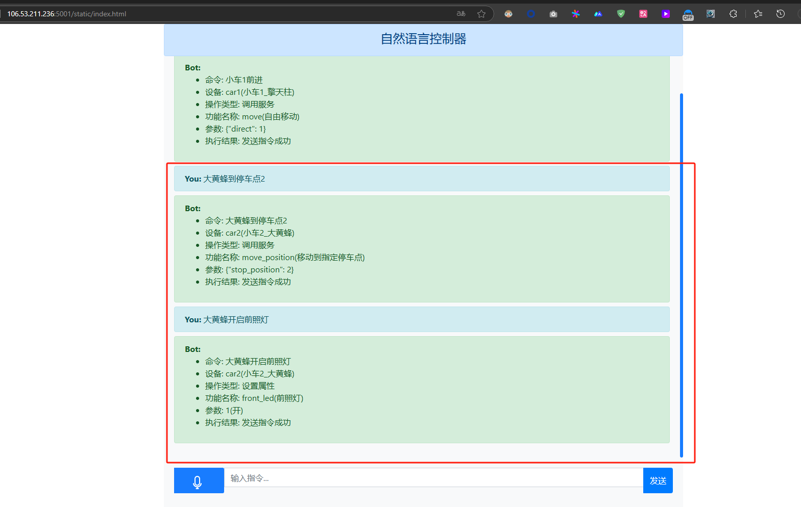

## 概览
### 项目介绍:

基于物联网平台的独立于平台和硬件的使用自然语言控制设备的应用, 使用大语言模型根据物模型理解用户意图

### 功能介绍: 

使用自然语言 控制设备, 设置设备属性, 获取设备状态, 在发送指令前可对发送指令进行检查

### 项目特点: 

对比于传统语言控制,如小爱,不用局限于固定的几个指令, 只要描述好物模型, 可以随意添加控制指令和设备

语言控制模块与原有项目是非耦合的可以独立运行, 只要提供设备物模型描述, 语言模型即可完成设备控制, 不需要在物联网平台和设备中修改代码,

即使是指令校验也不需要修改平台和设备代码, 只需要提供设备物模型描述, 模型即可完成指令校验, 实现自然语言编程


### 运行流程:
1. 将控制语言指令和所有需要语言控制的设备发送给大语言模型, 让大模型判断是控制那个设备
2. 获取设备的物模型描述(设备所有支持的功能的描述)
3. 将控制指令和设备物模型发送给大语言模型, 让大模型生成json指令
4. 将json指令和相关的功能描述和设备数据发送给大语言模型,让其判断指令是否能正确执行
5. 在校验后将执行指令发送给设备


## 运行
安装好python3环境

复制.env.example文件为.env, 并修改为阿里云物联网平台的实际参数

在项目目录下执行
```
pip install -r requirements.txt
python app.py
```

在浏览器访问 http://127.0.0.1:5001/

## 使用示例
设备端使用MQTT模拟器模拟通信, 物联网平台使用阿里云物联网平台, 以下是设备列表和设备的物模型数据


### 调用服务和设置属性
应用端

设备端


### 获取设备状态
应用端


### 指令校验
对于校验指令, 不需要在物联网平台和设备端进行任何修改, 只需要在物模型上设置好参数说明就行

物理网平台端:

应用端:


